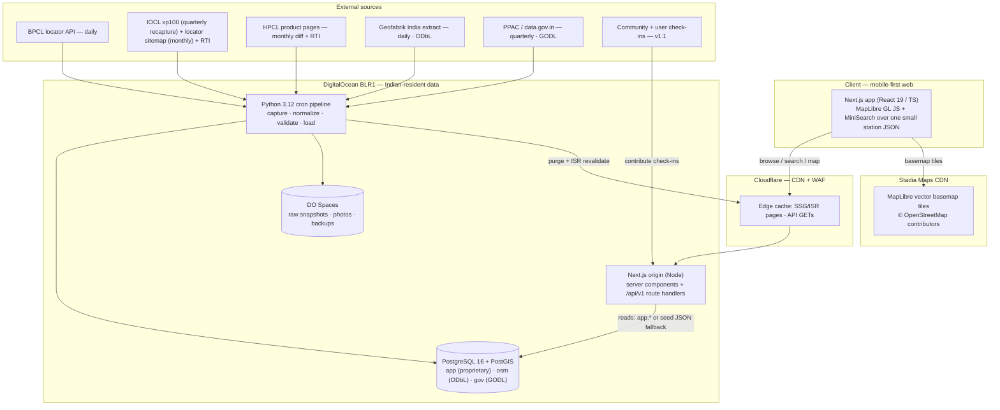

# Architecture

OctaneFinder is a mobile-first, SEO-driven web app whose defining constraint is that the dataset is
**tiny** (~300 premium outlets nationwide) but its value is **freshness**. That single fact drives
every decision below: no horizontal scale is designed in, the entire national layer can ship to the
browser, and the engineering budget goes into ingestion, provenance, and a verification loop — not
into throughput.

---

## 1. Stack

| Layer | Choice | Why (short) |
|---|---|---|
| Framework | **Next.js 15** (App Router, React 19, TypeScript strict) | SEO is the acquisition channel — every city/station must be a crawlable, pre-rendered URL. One codebase for pages + the thin API. |
| Language | **TypeScript**, `strict` + `noUncheckedIndexedAccess` | No `any` in exported signatures; index access is provably safe. |
| Styling | **Tailwind CSS** + CSS custom-property design tokens (`src/styles/tokens.css`) | Layout/spacing via utilities; brand/semantic colours via tokens, themed for light + dark. |
| Database | **PostgreSQL 16 + PostGIS**, accessed with **postgres.js** (raw SQL, **no ORM**) | ORMs are poor at geospatial SQL (`ST_DWithin`, KNN `<->`); raw tagged-template SQL keeps `PostGIS` first-class. |
| Search | **MiniSearch**, client-side | ~300 rows ship as one small JSON; typeahead is free and needs no search API. |
| Map | **MapLibre GL JS** (BSD-3), client-only, host-agnostic style URL | Commodity rendering with no SDK lock-in; tile source is a one-line style swap. |
| Auth | **Auth.js v5** (`next-auth@5-beta`), JWT sessions | Email magic-link + Google OAuth; browsing is anonymous, sign-in gates contribution only. |
| Validation | **zod** | One schema per API endpoint. |
| Hosting | **DigitalOcean BLR1** + managed Postgres + Spaces, behind **Cloudflare**; **Stadia Maps** tiles | India-resident data; see [DEPLOY.md](DEPLOY.md). |

Fonts are system stacks only (no webfonts). Accessibility target is WCAG 2.2 AA: visible focus
rings, 44px touch targets, `prefers-reduced-motion`, labelled controls, and a theme toggle that
stamps `document.documentElement.dataset.theme`.

---

## 2. The three-store data separation

There is **one** managed Postgres instance, but three **logically separated stores implemented as
schemas**. The boundary is a *licensing* requirement, not tidiness — merging stores 1 and 2 would
turn the combined table into an ODbL "Derivative Database" and drag the proprietary register under
share-alike.

```
app.*   — the proprietary premium-outlet register (the product & the moat).
          Our facts re-keyed into our own schema. Licensable IP.
          Tables: brands, states, cities, fuel_types, sources, stations,
                  station_fuels, data_provenance, users, user_reports,
                  verification_history, station_reliability, images, fuel_prices.

osm.*   — the ODbL OpenStreetMap geometry sidecar (Geofabrik India extract).
          Basemap density + brand normalization context ONLY.
          Table: osm.fuel_stations. Cross-referenced by suggestion, NEVER row-merged into app.*.

gov.*   — GODL-India government statistics (PPAC denominators, coverage KPIs).
          Table: gov.retail_outlet_stats. No outlet-level premium data lives here.
```

Runtime queries fully-qualify `app.` / `osm.` / `gov.` so nothing depends on `search_path`.

Two invariants the schema enforces by intent:

1. **`last_verified` advances only on a community check-in.** A poll or parse refreshes
   `sources` / `status`, never freshness. Current serving state is a *projection* of the
   append-only `app.verification_history` log — never hand-edited.
2. **No `app.stations` row carries a dealer-proprietor name** (potential personal data under DPDP).
   The station `name` is the business name only.

### Grade & availability taxonomy

Enums live in `migrations/0001_init.sql`. The reference data in `data/*.json` is the canonical
vocabulary the app compiles against:

- `data/grades.json` — the 5 `GradeMeta` (3 first-class E0 grades + 2 legacy).
- `data/brands.json` — `BrandMeta` with a `colorVar` (`--brand-iocl` / `--brand-hpcl` / `--brand-bpcl`).
- `data/origins.json` — 6 origin cities used for "near me" distance sorting.
- `data/stations.seed.json` — 24 seed `Station` rows (IOCL 12, HPCL 5, BPCL 7) across 13 cities.

---

## 3. The dual-source read pattern

This is the core structural idea that lets the app **build and run with zero infrastructure** while
still using Postgres in production. Every read query has two backends behind one signature:

```
                       getDb() (src/lib/db.ts)
                              │
              DATABASE_URL set? ──── no ──► seed JSON via src/lib/data.ts
                              │                (allStations, stationById, …)
                             yes
                              ▼
                   PostgreSQL app.* schema (postgres.js)
                   listStations / getStation / nearbyStations
```

- `src/lib/db.ts` `getDb()` is a lazy postgres.js singleton that returns **`null`** when
  `DATABASE_URL` is unset. Nothing connects at import time.
- `src/lib/data.ts` reads the committed JSON (`allStations()`, `stationById()`, `gradeMeta()`,
  `brandMeta()`, `origins()`, `cities()`). It never touches the DB.
- `src/lib/queries/stations.ts` (and `nearby.ts`) branch on `getDb()`: DB path when available, else
  the `data.ts` seed path. **Both paths return rows mapped to the identical `Station` shape**
  (`@/lib/types`), so callers can't tell which backend served them.

The DB path assembles the `Station` shape from the normalized register in SQL (LATERAL joins build
the `grades[]`, `price`, and `sources[]` JSON; `lastVerifiedDays` and `status` are derived from
`station_fuels.last_verified_at`; `firstSeen`/`lastVerified` come out as pre-formatted ISO text).

**Writes** (check-ins, corrections, moderation) are DB-only. Their query layers throw
`DbUnavailableError` when there's no DB, and the route handlers map that to `503 db_unavailable`.

### Hard build rules (why `next build` never needs infra)

1. Reads fall back to seed JSON — SSG and `generateStaticParams` use `data.ts`, never the DB.
2. `src/lib/env.ts` validates env **lazily** (a `Proxy` parses on first access); no missing secret
   throws during build. `hasDb()` / `hasAuth()` / `hasS3()` are pure `process.env` probes.
3. Every API route file sets `export const runtime = "nodejs"` and
   `export const dynamic = "force-dynamic"`.
4. `maplibre-gl` is imported only inside `"use client"` components — never in a server component or
   route handler.

---

## 4. Request flow

### Read (a station page, anonymous)

```
Googlebot / user
   → Cloudflare edge (SSG/ISR HTML, s-maxage + stale-while-revalidate)
   → Next.js server component (app/station/[id]/page.tsx)
   → getStation(id)  [src/lib/queries/stations.ts]
        → DB present?  app.* SQL   :  seed JSON (data.ts)
   → plain Station data rendered into server + client components
Map tiles load separately, lazily, from Stadia's own CDN (never touch our origin).
```

Server pages call the query layer **directly** — they never self-fetch their own HTTP API. The
`/api/v1/*` routes exist for the client app (map/filter/search interactions) and for writes.

### API (the client map view)

`app/map/page.tsx` renders `<AppShell>` (client) with `allStations()` seeded server-side. AppShell
owns `FilterState`, runs MiniSearch and grade/brand/E0 filtering **entirely client-side**, computes
distances with `geo.haversineKm`, and wires `Filters + MapLibreMap + StationList + StationDetail`.
`/api/v1/stations` and `/stations/nearby` back deep-links and progressive enhancement.

### Write (a check-in, v1.1)

```
signed-in user (Auth.js session)
   → POST /api/v1/checkins  (runtime=nodejs, dynamic=force-dynamic)
   → zod validation (checkinSchema) → 400 invalid_request on failure
   → requireSession()          → 401 unauthorized if no session
   → geofence check (≤ CHECKIN_GEOFENCE_KM of the station)
   → rateLimit() token bucket  → 429 if exceeded
   → checkins query layer      → 503 db_unavailable if no DB
   → 201 { id, newLastVerified }   (the ONLY event that moves last_verified)
```

### API envelope (uniform across `/api/v1/*`)

```ts
// success
{ data: T, meta?: { total, limit, offset, hasMore } }
// error
{ error: { code, message, details? }, requestId }
```

Helpers in `src/lib/api.ts`: `ok()`, `err()`, `requestId()`, `parsePaging()`, `requireSession()`,
`DbUnavailableError`. Standard error codes: `invalid_request` (400), `unauthorized` (401),
`forbidden` (403), `not_found` (404), `db_unavailable` (503), `s3_unavailable` (503).

---

## 5. System diagram



---

## 6. Caching

The national premium layer is small enough to serve as **one static JSON artifact**, which collapses
most of the caching problem. SSG/ISR pages are edge-cached and revalidated on publish; anonymous
cacheable GETs use `public, s-maxage=60, stale-while-revalidate=600`; write endpoints are
`no-store`. Invalidation is exact-URL purge on publish (deterministic URLs) plus short TTLs. Map
tiles are served by Stadia's CDN directly to the browser and never hit our origin. See
[RUNBOOK.md](RUNBOOK.md) for the publish/purge cadence and [DEPLOY.md](DEPLOY.md) for the tile
fallback (Protomaps on Cloudflare R2) trigger.
