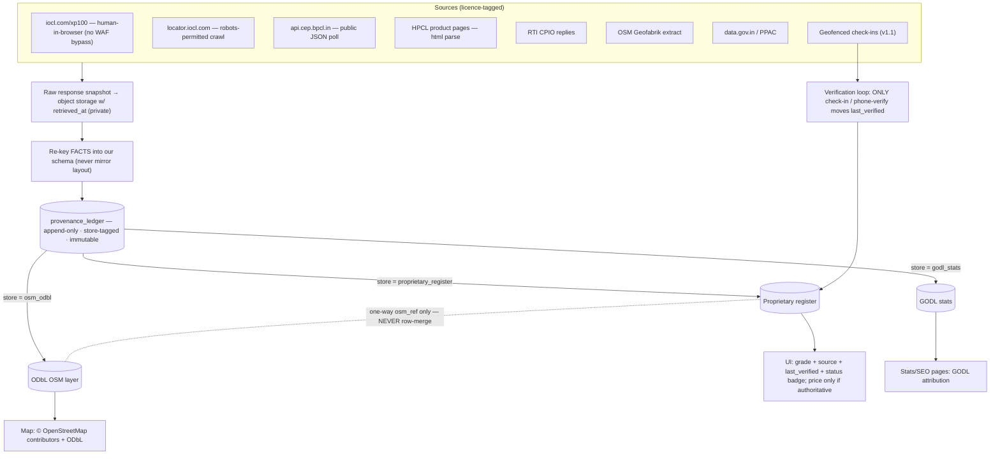

# Data Provenance — engineering requirement

> **Hard rule.** No fact renders in any OctaneFinder UI unless it traces to at least one row
> in an append-only provenance ledger. Every register row carries, per grade, a
> **source + licence + retrieval date + acquisition method**. If a fact cannot be traced to a
> ledger row, **it does not ship.**

This is not documentation of a nice-to-have — it is a build acceptance criterion (spec §9.10,
memo D.1). The ledger is simultaneously three things:

1. **The copyright defence.** It is the evidence that we took *facts*, not a *compilation*
   (`Eastern Book Co. v. D.B. Modak`, spec §9.1). We re-key facts into our own schema and store the
   raw source response only as a private forensic snapshot, never served.
2. **The licence firewall.** Its `store` column is the machine-enforced boundary between the three
   logically separated data stores (proprietary register / ODbL OSM layer / GODL statistics). OSM
   data may never be conflated into the register (spec §9.5, §9.6).
3. **The audit trail** for per-store licence compliance and OMC due diligence.

---

## 1. What every register row must carry

The serving projection exposes provenance through the shared `ProvenanceRef` type
(`src/lib/types.ts`), attached to every `Station` as `sources: ProvenanceRef[]`:

```ts
// src/lib/types.ts (authoritative — do not redefine)
export interface ProvenanceRef {
  source: string;      // human label of the origin, e.g. "IOCL XP100 RO list"
  license: string;     // licence tag, e.g. "facts:EBC-v-Modak" | "GODL-India" | "ODbL-1.0"
  retrievedAt: string; // ISO date/time the fact was acquired
  method: string;      // acquisition method, e.g. "human_browser_capture"
}

export interface Station {
  // ...
  sources: ProvenanceRef[]; // MUST be non-empty for any station that renders
  firstSeen: string;        // ISO date
  lastVerified: string | null; // moved ONLY by a check-in / curator phone-verification
  // ...
}
```

Each field of `ProvenanceRef` is a projection of one column of the underlying ledger row:

| `ProvenanceRef` field | Ledger column   | Meaning                                                        |
| --------------------- | --------------- | -------------------------------------------------------------- |
| `source`              | `source_label`  | Which source the fact came from                                |
| `license`             | `licence`       | The licence under which we may use it                          |
| `retrievedAt`         | `retrieved_at`  | When we acquired it (retrieval timestamp, not display time)    |
| `method`              | `acquired_via`  | How we acquired it (see the method enum below)                 |

Because reads fall back to committed seed JSON when `DATABASE_URL` is unset (contract §2), the
requirement holds **without a database too**: every station in `data/stations.seed.json` already
carries a non-empty `sources[]`, so the build-time / seed-fallback read path
(`src/lib/data.ts` → `allStations()`) satisfies the rule the same way the DB path does.

---

## 2. The ledger (source of truth for writes)

The ledger lives in Postgres, is created by the DB migrations, and is read/written through
`src/lib/queries/provenance.ts`. It is **append-only and immutable**: `UPDATE`/`DELETE` are revoked
at the role level and blocked by trigger. A correction is a *new row*, never a rewrite.

```sql
CREATE TYPE store_ns    AS ENUM ('proprietary_register','osm_odbl','godl_stats');
CREATE TYPE grade_enum  AS ENUM ('xp100','power_100','speed_100','power_99','speed_97');
CREATE TYPE fact_status AS ENUM ('official-listed','field-verified','stale');
CREATE TYPE acq_method  AS ENUM (
  'human_browser_capture',  -- iocl.com/xp100 — NO WAF circumvention
  'robots_permitted_crawl', -- locator.iocl.com sitemap, rate-limited, identified UA
  'public_api_poll',        -- api.cep.bpcl.in, unauth public JSON
  'html_table_parse',       -- HPCL poWer 99/100 product pages
  'rti_response',           -- RTI Act 2005 CPIO reply
  'osm_extract',            -- Geofabrik India .pbf — ODbL store only
  'godl_dataset',           -- data.gov.in / PPAC — GODL store only
  'phone_verification',     -- curator seeding call
  'community_checkin',      -- geofenced user check-in — ONLY event that moves last_verified
  'partner_feed'            -- e20petrol.in etc., permission only
);

CREATE TABLE provenance_ledger (
  event_id      bigint GENERATED ALWAYS AS IDENTITY PRIMARY KEY,
  event_ts      timestamptz NOT NULL DEFAULT now(),
  store         store_ns    NOT NULL,   -- licence firewall; never crossed by a value-copy
  ro_code       text,
  station_id    uuid,
  grade         grade_enum,             -- null for non-grade facts (geo, address)
  fact_kind     text        NOT NULL,   -- 'grade_availability'|'geopoint'|'address'|'price'
  fact_value    jsonb       NOT NULL,   -- RE-KEYED facts only; never raw source HTML
  source_label  text        NOT NULL,   -- → ProvenanceRef.source
  source_url    text,
  licence       text        NOT NULL,   -- → ProvenanceRef.license
  acquired_via  acq_method  NOT NULL,   -- → ProvenanceRef.method
  retrieved_at  timestamptz NOT NULL,   -- → ProvenanceRef.retrievedAt
  snapshot_uri  text,                   -- private forensic snapshot key; NEVER served
  actor         text        NOT NULL,   -- pipeline job id or curator user id
  status_after  fact_status,
  notes         text
);
```

### 2.1 The two enforcement guards (in the database, not the app)

Acceptance requires these constraints to be enforced by Postgres, so no application bug can breach
the licence firewall:

```sql
-- OSM-sourced events may only land in the ODbL store (no conflation into the register).
ALTER TABLE provenance_ledger
  ADD CONSTRAINT osm_stays_in_odbl
  CHECK (acquired_via <> 'osm_extract' OR store = 'osm_odbl');

-- Only a check-in or a curator phone-verification may assert field-verified status.
ALTER TABLE provenance_ledger
  ADD CONSTRAINT field_verified_needs_human_signal
  CHECK (status_after <> 'field-verified'
         OR acquired_via IN ('community_checkin','phone_verification'));
```

### 2.2 The serving projection

The register's serving row rolls up **from** the ledger. `source[]`, `first_seen`, `last_verified`,
`verification_method` and the recency-decayed `availability_score` are all derived; **only a
`community_checkin` (or a seeding `phone_verification`) advances `last_verified`.** A one-way
`osm_ref` may link a register row to an OSM node, but it is *never* a value-copy — the register
never stores a value taken from the OSM store.

---

## 3. Licence tags used in `ProvenanceRef.license`

| Tag                     | Store                  | Applies to                                                        |
| ----------------------- | ---------------------- | ----------------------------------------------------------------- |
| `facts:EBC-v-Modak`     | `proprietary_register` | Facts re-keyed from OMC pages (name, RO code, address, grade)     |
| `RTI-2005`              | `proprietary_register` | Facts obtained via an RTI Act reply                               |
| `contract-permission`   | `proprietary_register` | Facts supplied under written permission / a partner feed          |
| `ODbL-1.0`              | `osm_odbl`             | OpenStreetMap geometry / brand density                            |
| `GODL-India`            | `godl_stats`           | Government statistics (denominators, coverage KPIs)               |

`method` mirrors the `acq_method` enum values above.

---

## 4. Pipeline & UI flow



The rendering layer never reaches past the register/OSM/GODL projections; it reads
`Station.sources[]`, `Station.lastVerified`, and per-grade `status` — all provenance-backed.

---

## 5. Worked example

A single XP100 seed row for a Delhi outlet, captured from the public product page without
circumventing the WAF, and its projection into `ProvenanceRef`:

```json
{
  "event_id": 10472,
  "store": "proprietary_register",
  "ro_code": "102073",
  "grade": "xp100",
  "fact_kind": "grade_availability",
  "fact_value": { "available": true, "sales_area": "Moti Bagh, New Delhi" },
  "source_label": "IOCL XP100 RO list",
  "source_url": "https://iocl.com/xp100",
  "licence": "facts:EBC-v-Modak",
  "acquired_via": "human_browser_capture",
  "retrieved_at": "2026-07-30T04:11:55Z",
  "snapshot_uri": "s3://blr1-snapshots/iocl-xp100/2026-07-30/page.html",
  "actor": "curator:asha",
  "status_after": "official-listed"
}
```

projects to the station's `sources[]` entry:

```ts
{
  source: "IOCL XP100 RO list",
  license: "facts:EBC-v-Modak",
  retrievedAt: "2026-07-30T04:11:55Z",
  method: "human_browser_capture"
}
```

---

## 6. Acceptance criteria (F0)

A build is accepted only if all of the following hold:

- [ ] Every register row carries a per-grade **source citation, retrieval date, and status enum**
      (`official-listed` / `field-verified` / `stale`), surfaced as a non-empty
      `Station.sources: ProvenanceRef[]`.
- [ ] Each displayed fact derives from a ledger row (or, in the seedless read path, from the
      committed seed JSON that itself carries `sources[]`).
- [ ] `last_verified` is moved **only** by a `community_checkin` or a curator `phone_verification`.
- [ ] The `osm_stays_in_odbl` and `field_verified_needs_human_signal` constraints are enforced **in
      the database**, not merely in application code.
- [ ] The ledger is append-only: `UPDATE`/`DELETE` are revoked and blocked by trigger; corrections
      are new rows.
- [ ] Raw source snapshots live in private object storage and are **never served** to clients.

If any fact cannot be traced to a ledger row, it is withheld from the UI rather than shipped
unattributed.
